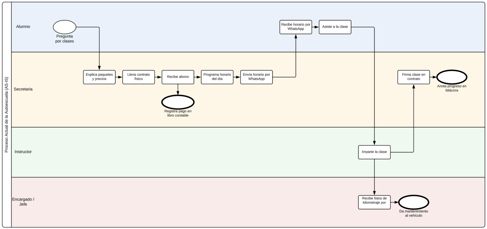
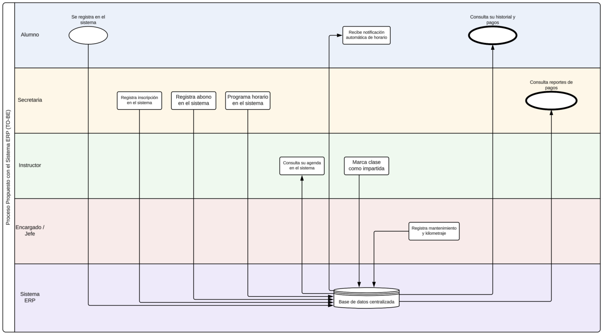

# 3. Diagramas BPMN

Se modelaron dos vistas del proceso principal de la autoescuela: el proceso
**actual** (AS-IS) y el proceso **propuesto** con el ERP (TO-BE).

## 3.1 Proceso actual — AS-IS

Flujo por carril (*lane*):

- **Alumno** — Pregunta por clases → recibe horario por WhatsApp → asiste a la clase.
- **Secretaria** — Explica paquetes y precios → llena contrato físico → recibe
  abono (*registra pago en libro contable*) → programa el horario del día →
  envía el horario por WhatsApp → firma la clase en el contrato (*anota progreso
  en la bitácora*).
- **Instructor** — Imparte la clase.
- **Encargado / Jefe** — Recibe fotos del kilometraje → *da mantenimiento al vehículo*.

**Puntos débiles:** registro en papel, pagos en libro contable, coordinación por
WhatsApp y progreso en bitácora física → información dispersa y no consultable.

## 3.2 Proceso propuesto — TO-BE

Flujo por carril con el sistema como eje central:

- **Alumno** — Se registra en el sistema → recibe notificación automática de
  horario → consulta su historial y pagos.
- **Secretaria** — Registra la inscripción en el sistema → registra el abono →
  programa el horario → consulta reportes de pagos.
- **Instructor** — Consulta su agenda en el sistema → marca la clase como impartida.
- **Encargado / Jefe** — Registra mantenimiento y kilometraje.
- **Sistema ERP** — Todos los carriles leen y escriben sobre una **base de datos
  centralizada**.

**Mejora clave:** cada acción manual/WhatsApp del AS-IS se reemplaza por una
operación contra la base de datos centralizada, habilitando notificaciones
automáticas, consulta de historial y reportes.

## Fuente editable

Los diagramas se elaboraron como imágenes. Cuando se disponga del archivo fuente
editable (Draw.io / diagrams.net, Lucidchart, etc.), guardarlo en
`assets/` junto a los `.png` para poder actualizarlos.

**Anterior:** [← Análisis del problema](../01-vision-general/analisis-problema.md) · **Siguiente:** [Arquitectura →](../03-arquitectura/diseno-tecnico.md)
