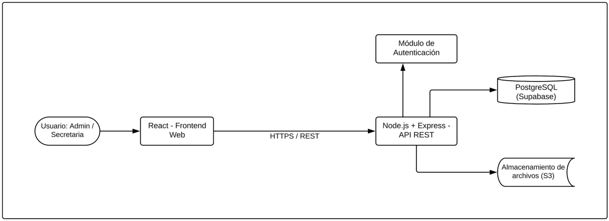

# 4. Diseño técnico y arquitectura

El sistema se desarrolla bajo un enfoque de **desarrollo desde cero**, con una
**arquitectura cliente-servidor de tres capas**.

## 4.1 Diagrama de arquitectura



```
Usuario (Admin/Secretaria)
        │  HTTPS / REST
        ▼
   React — Frontend Web        (capa de presentación)
        │  HTTPS / REST
        ▼
   Node.js + Express — API REST (capa de lógica de negocio)
        ├── Módulo de Autenticación
        ├──► PostgreSQL (Supabase)   (capa de datos)
        └──► Almacenamiento de archivos (S3)
```

## 4.2 Capas

| Capa | Responsabilidad | Tecnología |
|------|-----------------|-----------|
| **Presentación** | Interfaz web que consume la API REST. | React |
| **Lógica de negocio** | API REST centralizada: reglas de negocio + autenticación de usuarios. | Node.js + Express |
| **Datos** | Persistencia relacional y almacenamiento de archivos. | PostgreSQL (Supabase) + S3 |

## 4.3 Stack tecnológico

| Componente | Tecnología / Servicio | Notas |
|------------|----------------------|-------|
| Frontend | **React** | Consume la API REST vía HTTPS. Desplegado en **Vercel**. |
| Backend / API | **Node.js + Express** | API REST centraliza lógica de negocio y autenticación. Desplegado en **Render**. |
| Base de datos | **PostgreSQL** en **Supabase** | Servicio administrado en la nube. |
| Almacenamiento de archivos | **Amazon S3** | Evidencias: contratos digitalizados, fotografías del estado de los vehículos. |
| Autenticación | Módulo dentro de la API | Gestión de usuarios (Admin / Secretaria). |

## 4.4 Decisiones de diseño

- **API REST centralizada:** un único backend concentra la lógica de negocio y
  la autenticación; el frontend no accede directamente a la base de datos.
- **Base de datos administrada (Supabase):** evita el mantenimiento de un
  servidor de base de datos propio.
- **S3 para archivos:** los binarios (contratos escaneados, fotos de vehículos)
  no se guardan en la base relacional, sino en almacenamiento de objetos.
- **Despliegue en la nube:** frontend y backend se despliegan en Vercel y Render
  respectivamente, según lo definido en el [presupuesto](../06-gestion-proyecto/presupuesto.md).

El **modelo de datos** se diseñó a partir de las necesidades priorizadas en la
entrevista, con siete entidades principales: Alumno, Paquete, Clase, Instructor,
Vehículo, Mantenimiento y Pago. Ver [Modelo de datos →](../04-modelo-datos/modelo-datos.md).

**Anterior:** [← Procesos BPMN](../02-procesos/bpmn.md) · **Siguiente:** [Modelo de datos →](../04-modelo-datos/modelo-datos.md)
