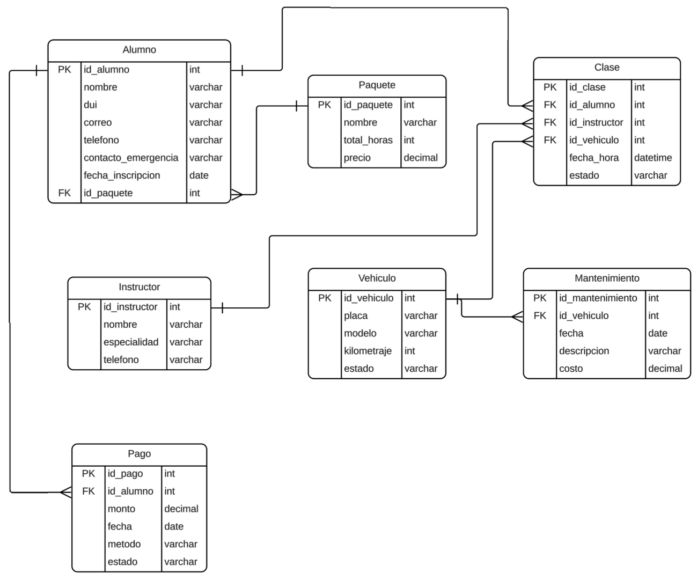
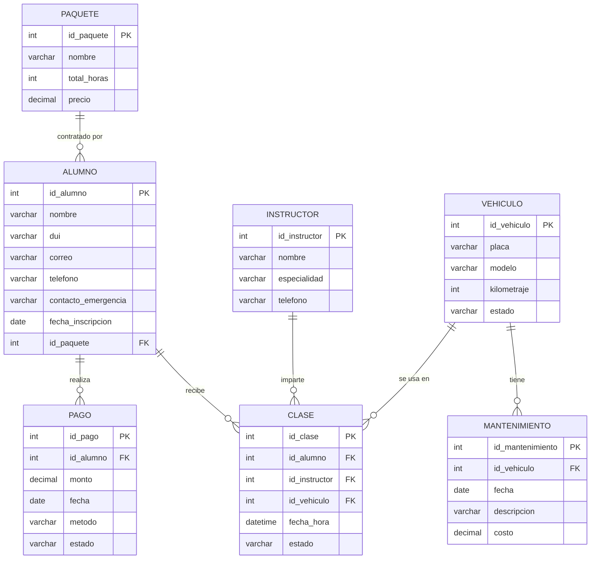

# 5. Modelo de datos

El modelo de datos se diseñó a partir de las necesidades priorizadas durante la
entrevista, con **siete entidades principales**: Alumno, Paquete, Clase,
Instructor, Vehículo, Mantenimiento y Pago.

## 5.1 Diagrama Entidad-Relación

Reproducción del mismo modelo en Mermaid (versionable en texto):

## 5.2 Relaciones

| Relación | Cardinalidad | Descripción |
|----------|--------------|-------------|
| Paquete → Alumno | 1 : N | Un paquete es contratado por muchos alumnos; cada alumno tiene un paquete. |
| Alumno → Clase | 1 : N | Un alumno recibe muchas clases. |
| Instructor → Clase | 1 : N | Un instructor imparte muchas clases. |
| Vehículo → Clase | 1 : N | Un vehículo se usa en muchas clases. |
| Vehículo → Mantenimiento | 1 : N | Un vehículo tiene muchos registros de mantenimiento. |
| Alumno → Pago | 1 : N | Un alumno realiza muchos pagos (abonos). |

> `Clase` funciona como entidad de cruce del negocio: relaciona **alumno +
> instructor + vehículo** en una fecha/hora concreta.

## 5.3 Diccionario de datos

### Alumno
| Campo | Tipo | Clave | Descripción |
|-------|------|-------|-------------|
| id_alumno | int | PK | Identificador del alumno. |
| nombre | varchar | | Nombre completo. |
| dui | varchar | | Documento Único de Identidad. |
| correo | varchar | | Correo electrónico. |
| telefono | varchar | | Teléfono de contacto. |
| contacto_emergencia | varchar | | Contacto de emergencia. |
| fecha_inscripcion | date | | Fecha de inscripción. |
| id_paquete | int | FK → Paquete | Paquete contratado. |

### Paquete
| Campo | Tipo | Clave | Descripción |
|-------|------|-------|-------------|
| id_paquete | int | PK | Identificador del paquete. |
| nombre | varchar | | Nombre del paquete (p. ej. Estándar, Intensivo). |
| total_horas | int | | Horas totales incluidas. |
| precio | decimal | | Precio del paquete. |

### Clase
| Campo | Tipo | Clave | Descripción |
|-------|------|-------|-------------|
| id_clase | int | PK | Identificador de la clase. |
| id_alumno | int | FK → Alumno | Alumno que recibe la clase. |
| id_instructor | int | FK → Instructor | Instructor asignado. |
| id_vehiculo | int | FK → Vehículo | Vehículo utilizado. |
| fecha_hora | datetime | | Fecha y hora programada. |
| estado | varchar | | Estado de la clase (p. ej. programada, impartida). |

### Instructor
| Campo | Tipo | Clave | Descripción |
|-------|------|-------|-------------|
| id_instructor | int | PK | Identificador del instructor. |
| nombre | varchar | | Nombre completo. |
| especialidad | varchar | | Especialidad (p. ej. autopistas, ciudad). |
| telefono | varchar | | Teléfono de contacto. |

### Vehículo
| Campo | Tipo | Clave | Descripción |
|-------|------|-------|-------------|
| id_vehiculo | int | PK | Identificador del vehículo. |
| placa | varchar | | Placa. |
| modelo | varchar | | Modelo. |
| kilometraje | int | | Kilometraje actual. |
| estado | varchar | | Estado (p. ej. activo, en mantenimiento). |

### Mantenimiento
| Campo | Tipo | Clave | Descripción |
|-------|------|-------|-------------|
| id_mantenimiento | int | PK | Identificador del mantenimiento. |
| id_vehiculo | int | FK → Vehículo | Vehículo al que se le da mantenimiento. |
| fecha | date | | Fecha del mantenimiento. |
| descripcion | varchar | | Descripción del trabajo realizado. |
| costo | decimal | | Costo del mantenimiento. |

### Pago
| Campo | Tipo | Clave | Descripción |
|-------|------|-------|-------------|
| id_pago | int | PK | Identificador del pago. |
| id_alumno | int | FK → Alumno | Alumno que realiza el pago. |
| monto | decimal | | Monto del abono. |
| fecha | date | | Fecha del pago. |
| metodo | varchar | | Método (p. ej. efectivo, tarjeta, transferencia). |
| estado | varchar | | Estado (p. ej. pagado, pendiente, vencido). |

**Anterior:** [← Arquitectura](../03-arquitectura/diseno-tecnico.md) · **Siguiente:** [Mockups →](../05-diseno-ui/mockups.md)
