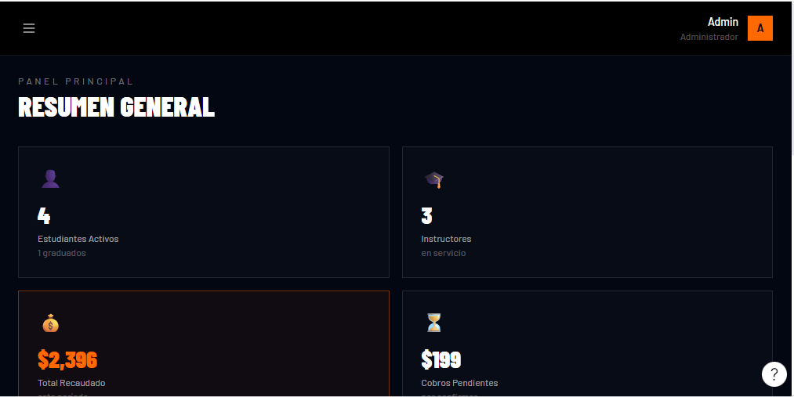
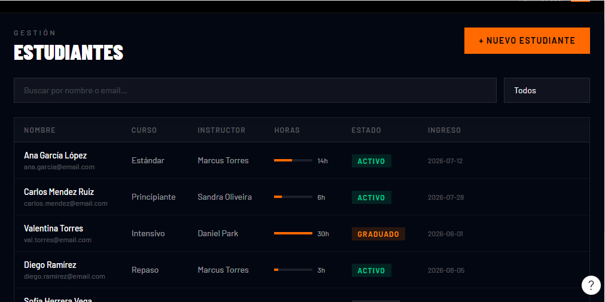
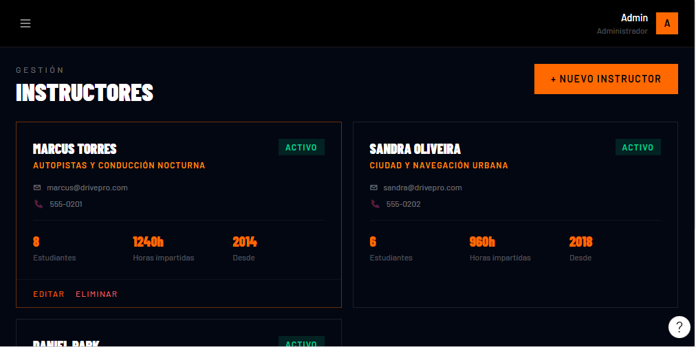
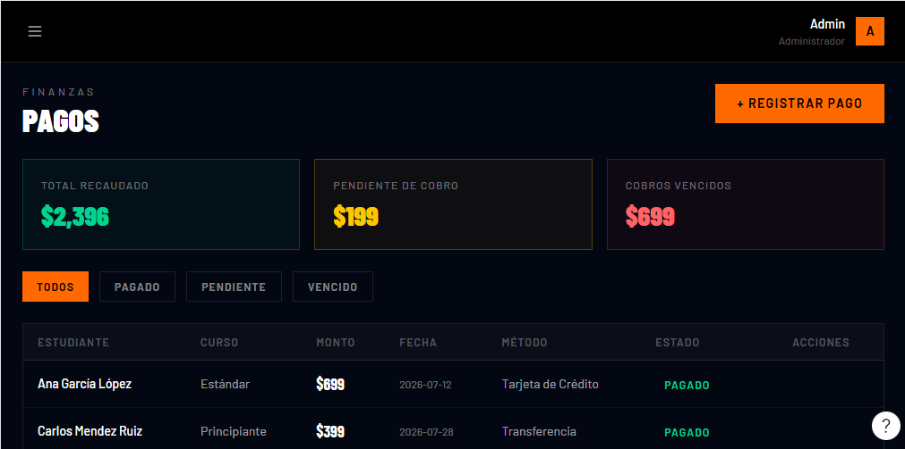

# 6. Mockups

Prototipos de las pantallas principales, diseñados en Figma. La identidad visual
usa una interfaz oscura con acentos naranja (marca **Dunamis / DrivePro**).

## 6.1 Landing pública

Página de inicio orientada a captar alumnos: navegación (Cursos, Instructores,
Precios, Testimonios, Contactos), llamada a la acción de registro y acceso Admin.

## 6.2 Gestión de Estudiantes

Listado administrativo de estudiantes con búsqueda, filtro por estado y alta de
nuevo estudiante. Cada fila muestra nombre/correo, curso, instructor, progreso de
horas, estado (Activo / Graduado) y fecha de ingreso.

## 6.3 Gestión de Instructores

Tarjetas por instructor con especialidad, datos de contacto y métricas
(estudiantes asignados, horas impartidas, antigüedad), con acciones de editar /
eliminar y alta de nuevo instructor.

## 6.4 Finanzas — Pagos

Panel financiero con indicadores (Total recaudado, Pendiente de cobro, Cobros
vencidos), filtros por estado (Todos / Pagado / Pendiente / Vencido) y tabla de
pagos con estudiante, curso, monto, fecha, método y estado.

## Fuente editable

Los mockups provienen de Figma (plan Starter). Enlazar aquí el archivo de Figma
del equipo cuando esté disponible, para mantener la fuente editable junto a esta
documentación.

**Anterior:** [← Modelo de datos](../04-modelo-datos/modelo-datos.md) · **Siguiente:** [Cronograma →](../06-gestion-proyecto/cronograma.md)
