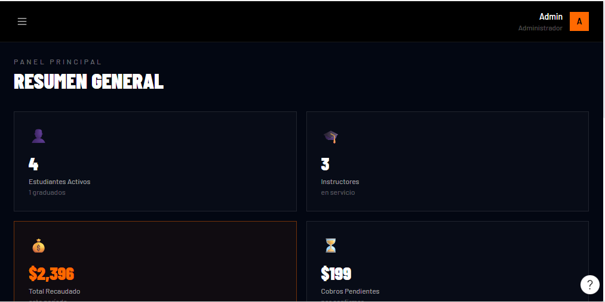
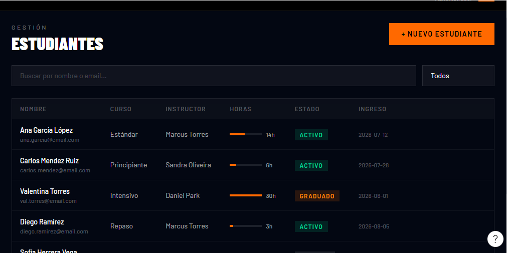
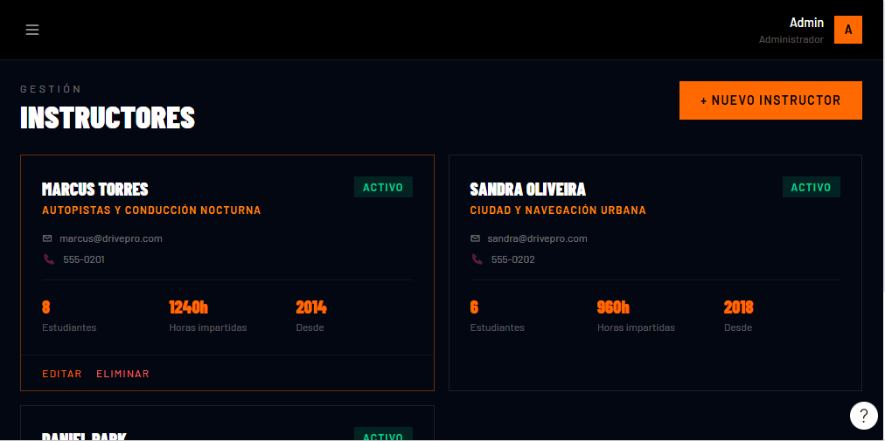
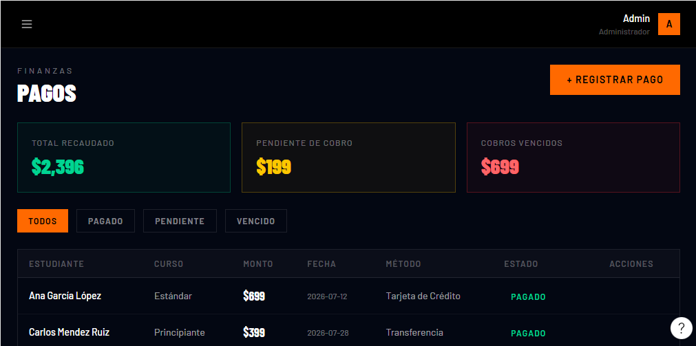
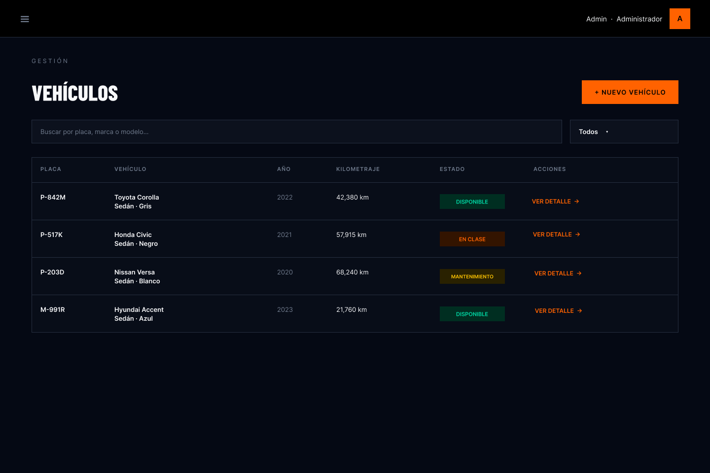
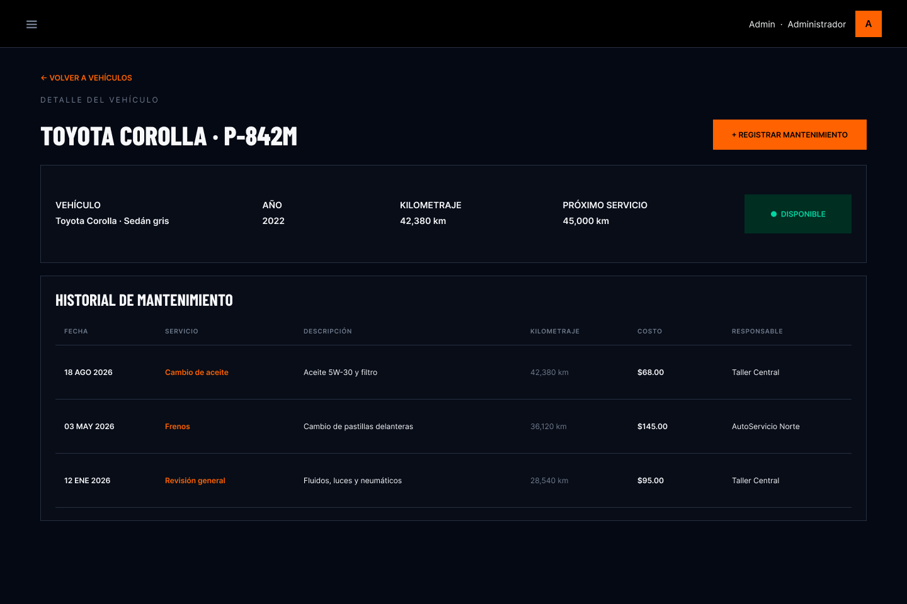
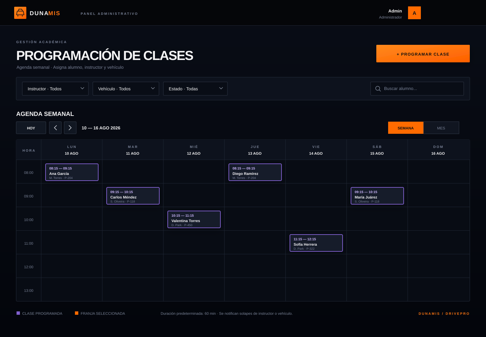

# 6. Mockups

Prototipos de las pantallas principales, diseñados en Figma. La identidad visual
usa una interfaz oscura con acentos naranja (marca **Dunamis / DrivePro**).

## 6.1 Dashboard Principal

Página de inicio orientada a resumir las principales actividades realizadas
por el usuario, con indicadores de progreso, cursos activos, pagos.

## 6.2 Gestión de Estudiantes

Listado administrativo de estudiantes con búsqueda, filtro por estado y alta de
nuevo estudiante. Cada fila muestra nombre/correo, curso, instructor, progreso de
horas, estado (Activo / Graduado) y fecha de ingreso.

## 6.3 Gestión de Instructores

Tarjetas por instructor con especialidad, datos de contacto y métricas
(estudiantes asignados, horas impartidas, antigüedad), con acciones de editar /
eliminar y alta de nuevo instructor.

## 6.4 Finanzas — Pagos

Panel financiero con indicadores (Total recaudado, Pendiente de cobro, Cobros
vencidos), filtros por estado (Todos / Pagado / Pendiente / Vencido) y tabla de
pagos con estudiante, curso, monto, fecha, método y estado.

## 6.5 Vehículos y Mantenimiento

Listado de vehículos con búsqueda, filtro por estado, kilometraje y acceso al
detalle. La vista de detalle muestra la información del vehículo y su historial
de mantenimientos.

## 6.6 Programación de Clases

Calendario semanal para consultar y crear clases. Cada bloque muestra horario,
estudiante, instructor y vehículo; los filtros permiten enfocar la agenda. El
formulario de alta debe seleccionar estudiante, instructor y vehículo. Si alguno
ya está ocupado durante la franja, la interfaz muestra el conflicto informado por
la API antes de confirmar la programación.

## Fuente editable

Los mockups fueron diseñados en Figma y mantienen la identidad visual oscura con
acentos naranja de Dunamis / DrivePro.

[Ver archivo editable de Vehículos y Mantenimiento en Figma](https://www.figma.com/design/zS8ORWm8qfY7BWaNb4yZM0)

> El mockup de programación se entrega como SVG editable dentro del repositorio,
> siguiendo la identidad visual de las pantallas aprobadas del sistema.

**Anterior:** [← Modelo de datos](../04-modelo-datos/modelo-datos.md) · **Siguiente:** [Cronograma →](../06-gestion-proyecto/cronograma.md)
